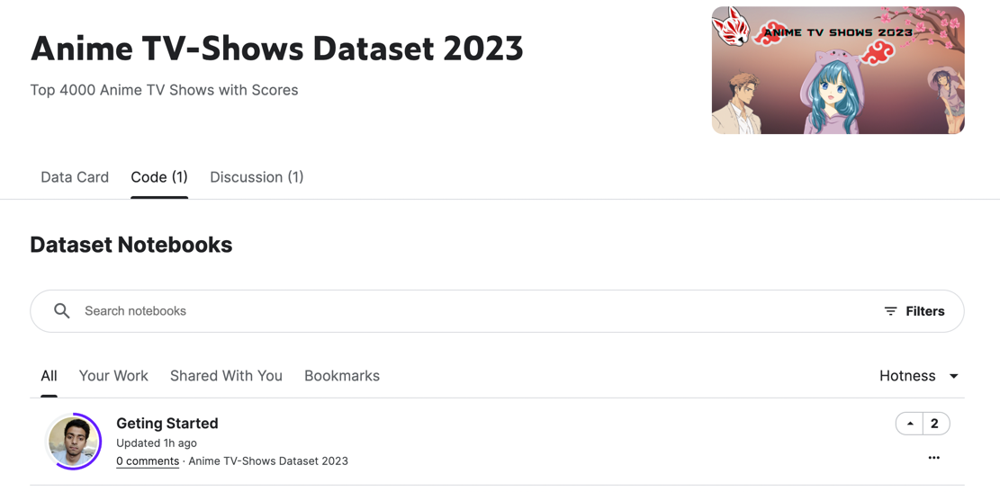

# Datacamp Project

__Fiona Hak1, Elora Vigo1, Céline Guo1, Shun Robert1 et  Julien Giovanazzi2__
 
1. M2 AMI2B 2. M2 Agro

This repository hosts the versioned source code of our dataset analysis for the Datacamp course.

### Requirements

Requirements are available in the file requirements.txt.

### How to use

Analysis of the dataset was carried out following the instructions in the RAMP documentation. The results can be viewed in the jupyter notebook.
To launch in a terminal:

    ramp-test --submission starting_kit

### Dataset

We used the "Anime TV-Shows Dataset 2023" found on 27/01/2024 (https://www.kaggle.com/datasets/forgetabhi/anime-tv-shows-dataset-2023/). NB: when we found it, no completed Notebooks were yet available on the platform processing this dataset.
 

 

### License
Apache 2.0